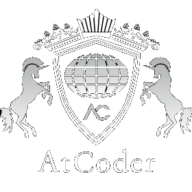

# 
Welcome to my GitHub profile   

# - I'm **Ahmed Gamal**  

    
     
    

  

 

> "The future depends on what you do **now**"

 

<!-- About -->
## <picture>  </picture>  About me 

  

<ul>
<li>I have a Bachelor's degree in <strong>Computer Science</strong> from Suez Canal University</li>
<li> I'm two times <strong>ACPC Finalist</strong></li> 

<li> I enjoy <strong>Problem Solving</strong> and <strong>Programming Competitions</strong></li>  

<li>I have worked as a full-stack software engineer using <strong>React.js</strong> and <strong>Django</strong></li>

<li>I love develping applications using <strong>React.js</strong></li>

<li>Passionate about <strong>Software Development</strong> and <strong>Emerging Technologies</strong></li>

<li> Looking forward to being a great Software Engineer</li>

<li> I'm into <strong>Data Structures</strong> & <strong>Algorithms</strong> <3 </li>

<li> You can look at my <a href="https://drive.google.com/file/d/1rBY5RnjqSN0YynpG6xJc-0g5VwmaVm_h/view?usp=sharing" target="blank"><strong>Resume</strong></a> for more Details about me and my work / volunteering experience  </li>

</ul>

 

 

<!-- platforms & where to find me -->
## 
  Where to find me? 

    
    
	
         

 

<!-- github stats and trophies -->
## 
 GitHub Stats

    
      
    
      
    
      
    

  

## 
  Technologies, Languages, and Tools 

    
    
    
    
    
    
    
    
    
    
    
    
    

## 
 Currently Learning / Interested In
 

    
    
    
    
    
    

 

    
    
    
    
    

 

<!-- how to reach me -->
## 
 How to Reach Me 

<!-- -->

	
	
	
	
	

<!-- end -->

    
Don't forget to give this repo a star   Thank you for your attention  

    

